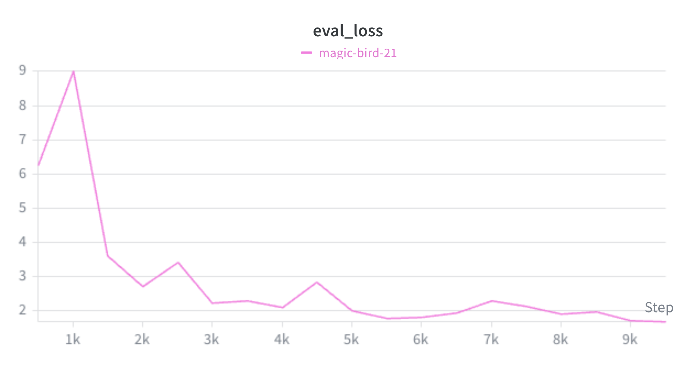
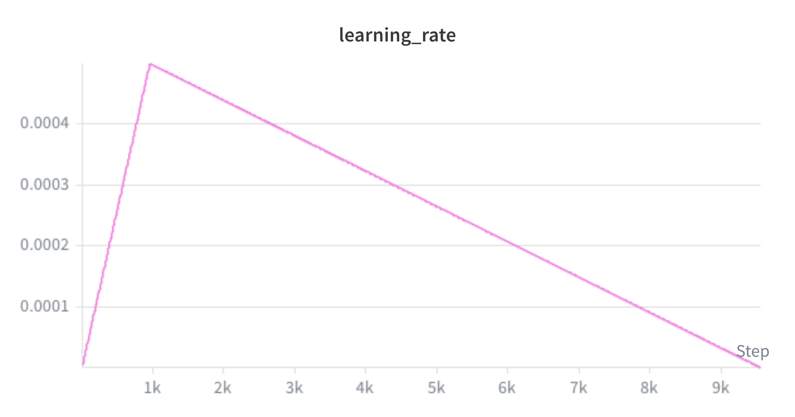

# LLMGuardrails-finetune


## Idea

The goal of this project is to fine-tune a small, efficient BERT-like model specifically for prompt injection detection.

For prompt injection safety, Large Language Models (LLMs) cannot be fully trusted as judges; adversarial prompts can easily manipulate the evaluator's behavior. Training a specialized LoRA adapter on top of a lightweight base model (such as DeBERTa or RoBERTa) offers a robust and cost-effective alternative.

**fastino/gliguard-LLMGuardrails-300M** is a small (0.3B) multi-labels, multi-domains, tasks model:
- Prompts safety (and Text Classification)
- NER (Named Entity Extraction),
- Structured data extraction
- Etc,

Source model: [fastino/gliguard-LLMGuardrails-300M](https://huggingface.co/fastino/gliguard-LLMGuardrails-300M),
documentation: [GLiNER2-Tutorial](https://github.com/fastino-ai/GLiNER2/tree/main/tutorial)

We selected this model because it is relatively small (0.3B parameters), CPU/GPU friendly, and uses a modern architecture: **[GLiNER2](https://github.com/fastino-ai/GLiNER2)** (a Generalist Model for Named Entity Recognition), which is built on the bidirectional **[DeBERTa](https://huggingface.co/microsoft/deberta-v3-base)** encoder architecture.

It provides a 2048-token context window—more than sufficient for typical prompt-injection tests and multi-turn conversations—and the baseline model is already pre-trained for **prompt safety**. 

**License:** Apache 2.0

### Datasets

For training and validation, we aggregated three prominent prompt injection datasets. These records were deduplicated and standardized under a single unified `prompt_safety` classification task, for a total of **23,563 prompts**. Each source dataset is available on Hugging Face:

- [neuralchemy/Prompt-injection-dataset](https://huggingface.co/datasets/neuralchemy/Prompt-injection-dataset)
- [S-Labs/prompt-injection-dataset](https://huggingface.co/datasets/S-Labs/prompt-injection-dataset)
- [xTRam1/safe-guard-prompt-injection](https://huggingface.co/datasets/xTRam1/safe-guard-prompt-injection)

## Setup

Local setup for training the model

1. **Project**:
   - Install `uv`: `curl -LsSf https://astral-sh/uv/install.sh | sh`
   - Sync deps: `uv sync --all-extras`

2. Setup wandb:
   - Login:
     ```bash
     wandb login
     ```

## Running

- **Streamlit frontend**: `uv run streamlit run src/streamlit_app/app.py`

- **CLI dataset preparation**: `uv run python -m src.finetuner.data.prepare_data`

- **CLI training**: `uv run python -m src.finetuner.train`

- **CLI validation eval**: 
  - `uv run python -m src.finetuner.eval --validate --max-samples 100` # load adapters/final/ by default
  - `uv run python -m src.finetuner.eval --validate --adapter None --max-samples 100` # for base model

- **CLI single inference**: `uv run python -m src.finetuner.eval --prompt "Write a script to hack a database."`

## Results

On prompt classification "prompt_safety" task, using the whole validation dataset (`data/valid.jsonl`, 2360 samples):

| Model                                            | Accuracy | F1 Score | Precision | Recall |
| ------------------------------------------------ | :------- | :------- | --------- | ------ |
| fastino/gliguard-LLMGuardrails-300M (base model) | 75.47%   | 61.53%   | 88.87%    | 47.05% |
| final adapter (in adapters/final/)               | 98.35%   | 98.02%   | 98.17%    | 97.87% |

### Training logs
https://wandb.ai/corentin-l/guardrail-finetune/runs/1fux5p6j

## ⚠️ Limitations & Future Work

### 📈 Training Convergence & Loss Analysis


* **Test Loss Scale (Batch Sum Aggregation):** 
  - The test loss (rendered as `test_loss` on WandB) is computed from a split of the training dataset (`data/train.jsonl`, $\approx 21,230$ samples).
  - The test loss starts at **`6.2`**, spikes to **`9.0`**, and converges to **`1.68`** after 2 training epochs. 

* **Per-Sample Loss:** 
  - The starting loss of **`6.2`** ($0.775$ per sample) reflects the baseline pre-trained model's performance on the test split (matching the $75.47\%$ base accuracy).
  - A final test loss of **`1.68`** equates to an average loss of **`0.21` per sample**.

---

### 🔍 Known Behaviors & Edge Cases

* **Length Bias:**
  The adapter model is a bit "aggressive" on short prompts, which leads to false positives. This model is designed to be used as a **Tier-2 Semantic Layer**. A lightweight **Tier-1 filter** (e.g., Naive Bayes or a semantic cache) should instantly route standard conversational queries to minimize latency and filter out obvious edge cases, protecting the adapter from out-of-distribution noise.

* **Single-Turn Context Limitation:**
  The baseline model supports a **2048-token context window**. Real-world injection vectors often unfold across multi-turn dialogs (e.g., steering-based jailbreaks). Fine-tuning on multi-turn prompt templates with conversational turn-delimiters is an essential next step.

---

### 🛠️ General Optimizations

To improve adapter performance, we can consider modifying these parameters:

| Parameter | Current Default | To experiment | Rationale |
| :--- | :--- | :--- | :--- |
| **Epochs** | `2` | `3 - 4` | Allows the test loss to converge fully. |
| **LoRA Target Modules** | `["encoder"]` | `["query", "key", "value", "output"]` | Target all attention layers to increase capacity. |
| **LoRA Rank ($r$)** | `8` | `16` or `32` | Captures more complex semantic signatures. |
| **Learning Rate Schedule**| Warmup + Linear Decay (`linear`) | `cosine`, `constant` | Smooths encoder updates to mitigate representation shock (peak loss ~9) . |


